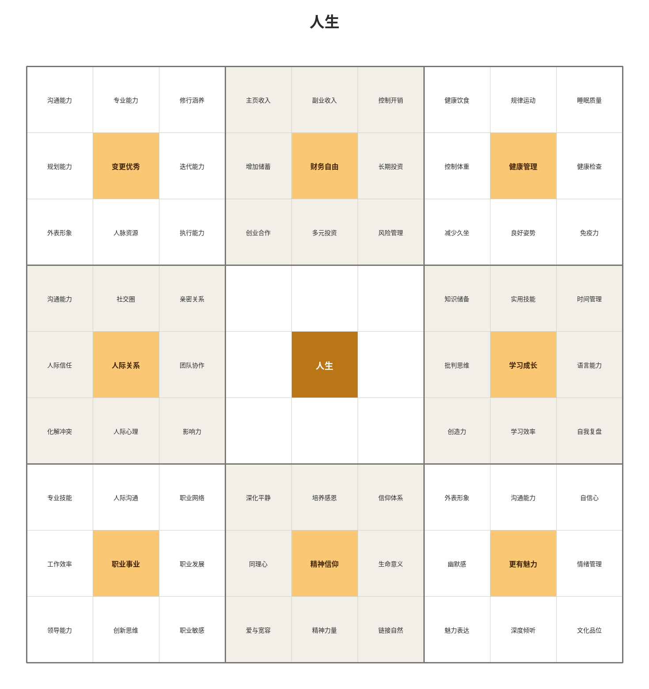
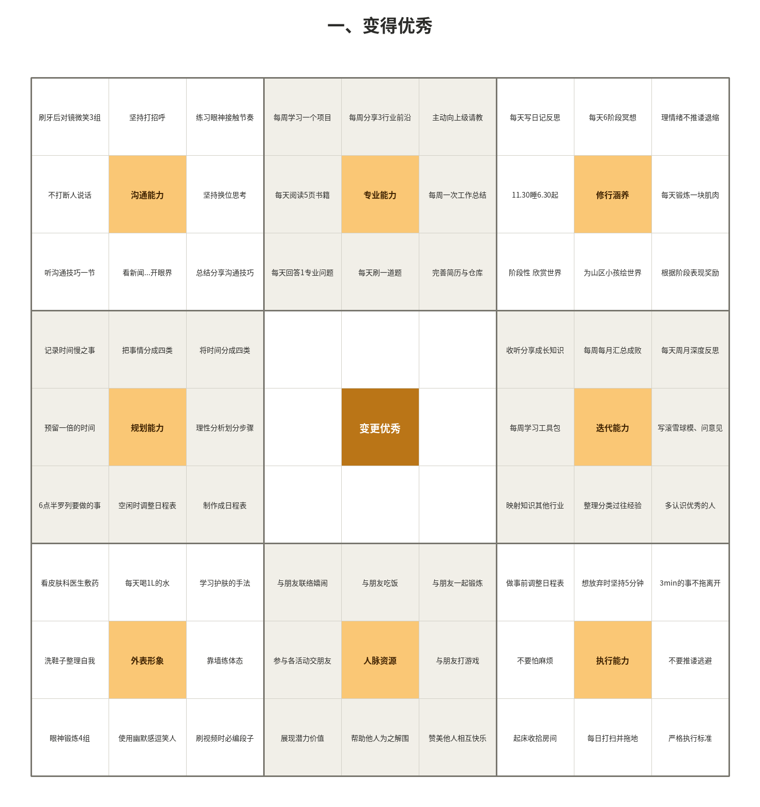
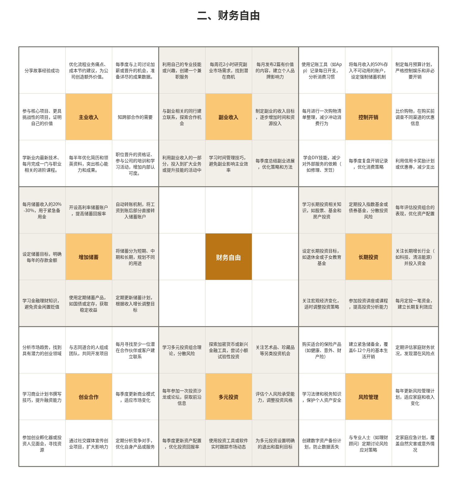
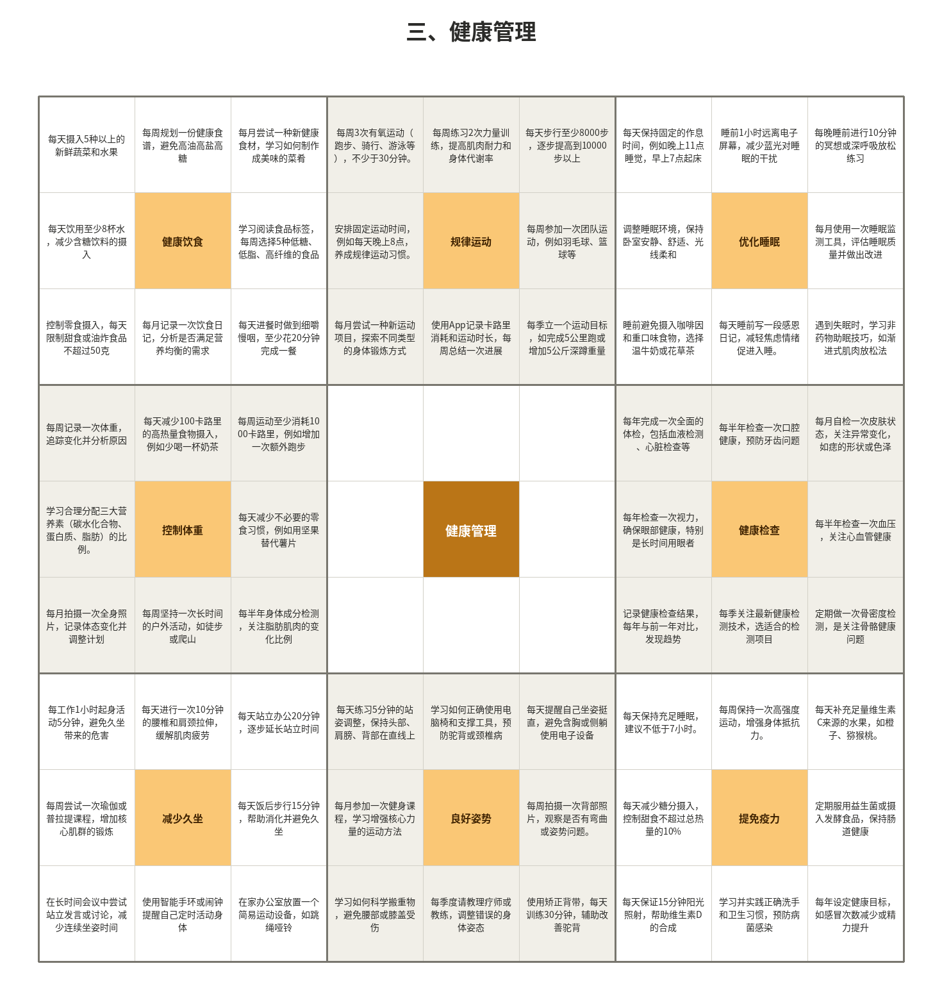
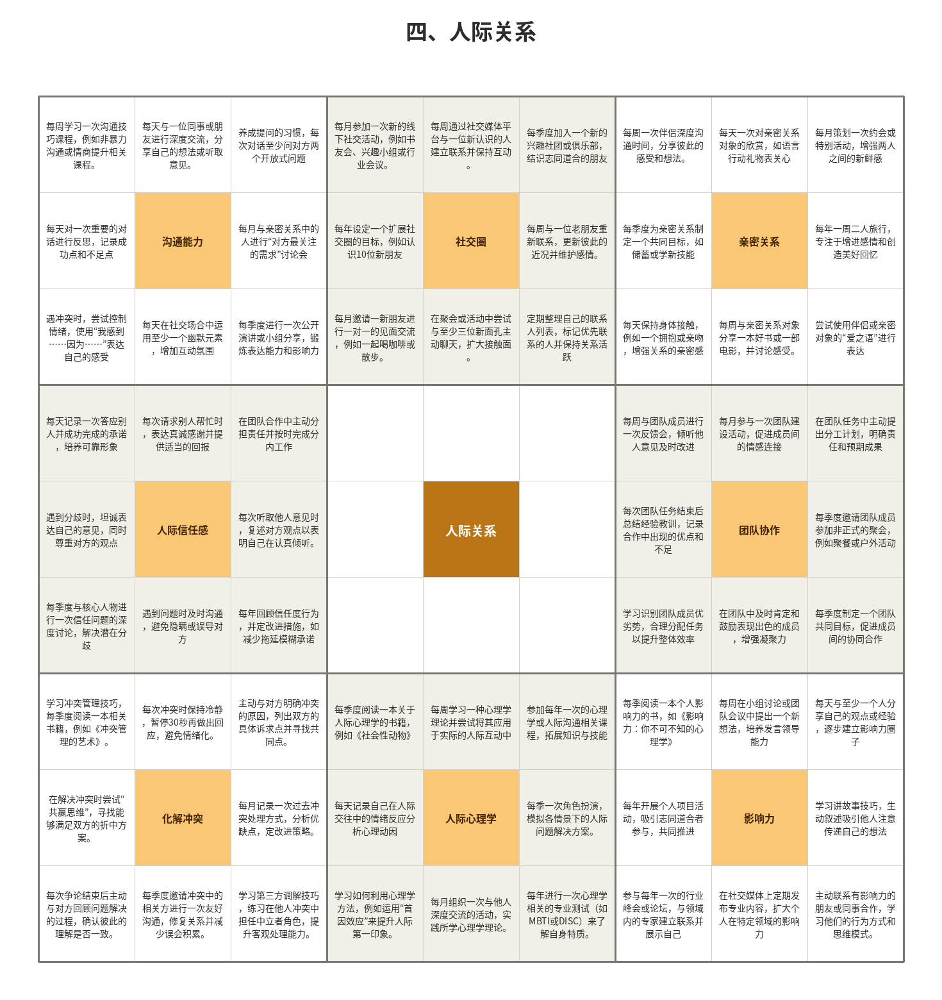
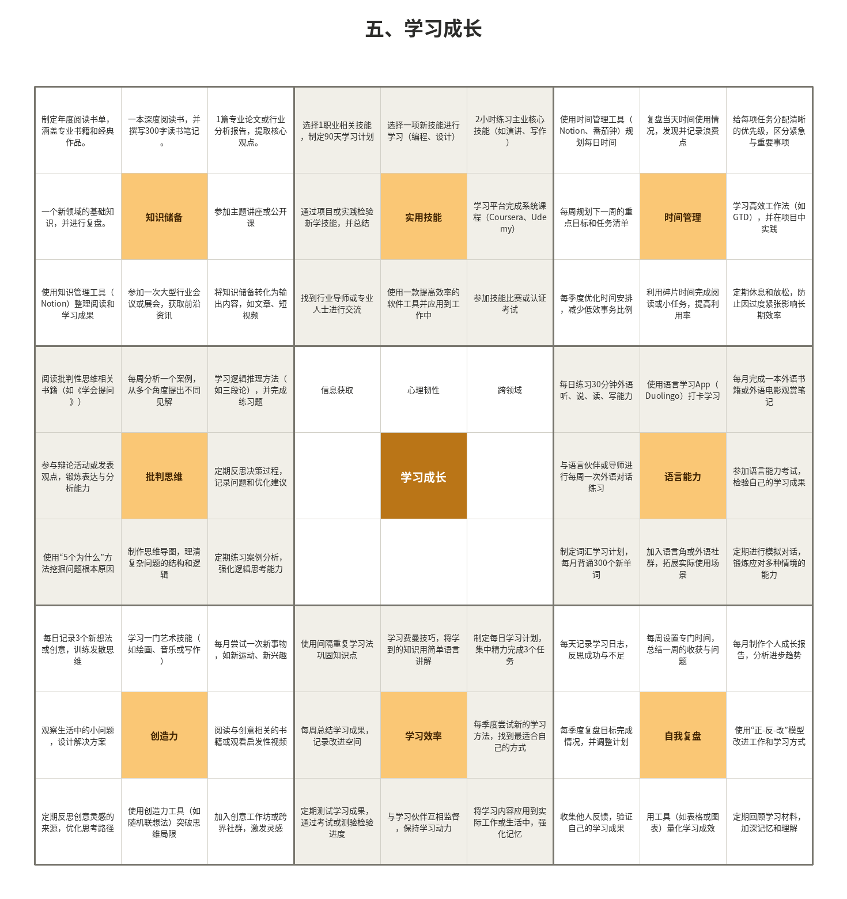
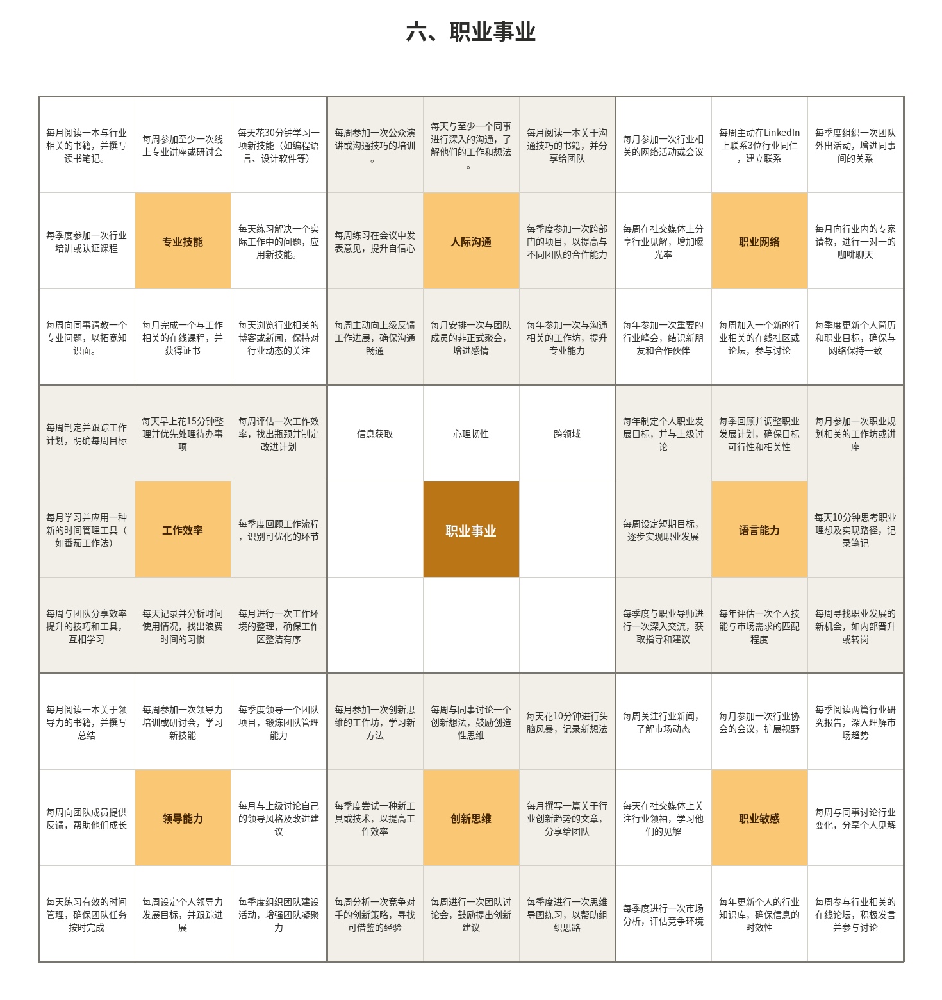
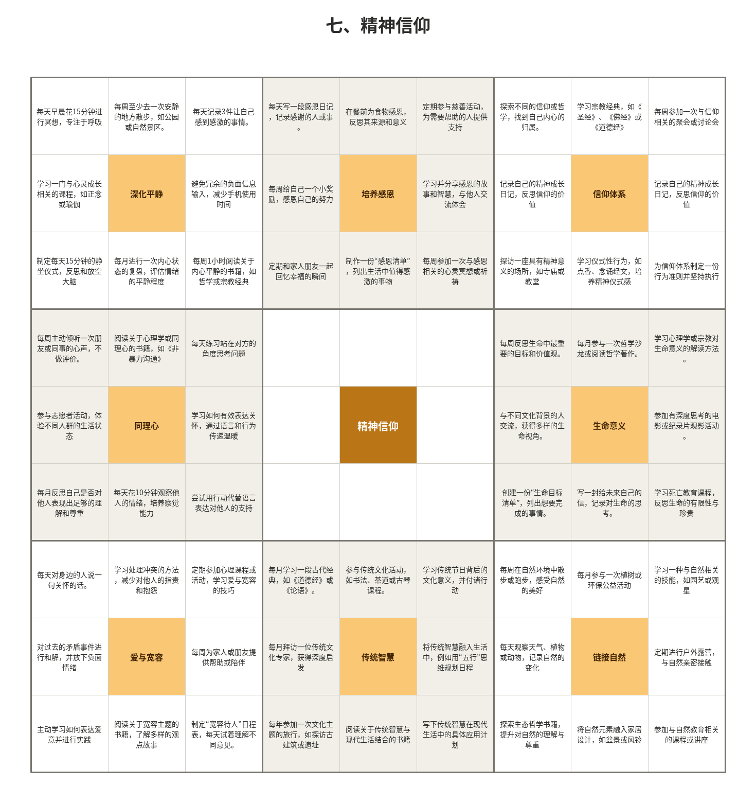
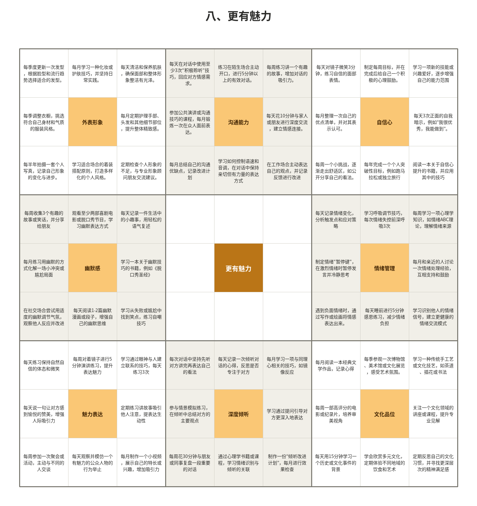

# 曼陀罗人生目标 —— 从"看着眼花"到"真的能做"

> 背景：这份曼陀罗图是2年前做的，做完之后一直没有真正执行。今天想重新捡起来，先搞清楚"为什么当时没执行下去"，再给出一套能落地的方法。

---

## 一、先诊断：为什么512个目标执行不下去

曼陀罗九宫格法本质上是一个**发散式思维工具**，用来做"目标拆解"和"头脑风暴"——它天生就是用来让你看到"原来这个目标下面有这么多可能性"的。

但它**不是**一个执行工具。问题出在三点：

1. **认知负荷过载**：512个目标同时摆在眼前，大脑无法从中挑出"现在该做哪一个"，于是干脆什么都不做——这是典型的"选择瘫痪"。
2. **没有时间锚点**：图上每一格都是"要做的事"，但没有告诉你"这周做哪个、这个月做哪个"，目标和日历之间没有连接。
3. **没有优先级排序**：8个一级目标（变得优秀、财务自由、健康管理、人际关系、学习成长、职业事业、精神信仰、更有魅力）被平等对待，但现实中你的时间和精力不是平等分配的，总有1-2个对当下更重要。

**结论**：不是这套目标体系不好，而是**"发散"和"执行"需要用两套不同的工具**。图留着当"目标地图"没问题，但日常执行要用另一套简化过的清单。

---

## 二、核心策略：做减法，从512个目标"收缩"到3-5个动作

把曼陀罗图想象成一个漏斗：

```
1个人生
 └─ 8个一级目标  ← 第①层筛选：选1个（最多2个）
     └─ 8个二级目标  ← 第②层筛选：选2-3个
         └─ 8个三级目标  ← 第③层筛选：每个二级目标下选1-2个
```

最终落到日历上的，应该只有 **3～6个具体的、可执行、可量化的动作**，而不是64个或512个。

### 筛选原则
- **相关性优先**：选和你当下人生阶段最相关的一级目标，而不是最想要的那个。比如同时想健康管理、财务自由、职业事业，问自己"接下来1年，哪个不做会拖累其他所有目标？"
- **可验证优先**：三级目标里，能直接判断"做了/没做"的（如"每天阅读5页书籍"）比模糊的（如"提升自信心"）更适合先执行。
- **低启动成本优先**：先选不需要额外准备、今天就能开始的动作，建立执行的惯性，再逐步加难度。

---

## 三、具体执行方法：单核心目标 + 分层节奏

### Step 1｜季度：锁定 1 个一级目标
从8个一级目标中选1个作为本季度（约3个月）的主战场。其余7个不是不要，是**暂时冻结**，不参与本季度的日常执行。

### Step 2｜月度：从该主题的8个二级目标中选 2-3 个
对照该一级目标所在的3x3宫格，挑出你现阶段最需要补的2-3格。

### Step 3｜周度：每个二级目标下选 1-2 个三级行动
不要选全部8个，选最容易坚持、最能立刻看到反馈的1-2个，写进本周待办。

### Step 4｜每天/每周：只看这周清单，不看整张曼陀罗图
把这几条动作单独抄到日历、Todo工具或便签上。曼陀罗图作为"总地图"偶尔回顾即可，日常不需要打开它。

### Step 5｜每周复盘（10分钟以内）
三个问题：
- 这周定的动作做了几个？
- 没做的是因为"太难"还是"忘了"？
- 下周要不要换一批三级目标？

**不做深度复盘**，避免复盘本身变成新的负担。

---

## 四、可直接套用的精简周期表模板

| 层级 | 数量 | 示例 |
|---|---|---|
| 本季度一级目标 | 1个 | 职业事业 |
| 本月二级目标 | 2-3个 | 专业技能、工作效率、职业网络 |
| 本周三级行动 | 3-5个 | 每天花30分钟学新技能、每周参加一次线上讲座、每周主动联系1位行业同仁 |

每周只需要维护这一张小表，而不是打开512格的大图。

---

## 五、关于第一个季度该选哪个一级目标

如果实在拿不准从哪个开始，可以用这个简单排序法：**先问"不做会拖累其他目标的是哪个"，再问"哪个现在最容易看到进展"**，两者兼顾的排第一。

一个常见的实用组合是：**职业事业 / 学习成长** 二选一作为主线，**健康管理**里挑1-2条作为并行的基础项（因为它是所有其他目标的执行力保障，且改动成本低、反馈快）。具体选哪个，还是取决于你自己当下最想解决的卡点是什么。

---

## 六、一句话总结

> 曼陀罗图负责"想清楚"，精简周期表负责"做起来"。两年前你已经完成了"想清楚"这一步，现在要做的只是从这512个目标里，每次只掏出3-5个放进日历。


# 人生

| 沟通能力 | 专业能力 | 修行涵养 | 主页收入 | 副业收入 | 控制开销 | 健康饮食 | 规律运动 | 睡眠质量 |
| -------- | -------- | -------- | -------- | -------- | -------- | -------- | -------- | -------- |
| 规划能力 | 变更优秀 | 迭代能力 | 增加储蓄 | 财务自由 | 长期投资 | 控制体重 | 健康管理 | 健康检查 |
| 外表形象 | 人脉资源 | 执行能力 | 创业合作 | 多元投资 | 风险管理 | 减少久坐 | 良好姿势 | 免疫力   |
| 沟通能力 | 社交圈   | 亲密关系 |          |          |          | 知识储备 | 实用技能 | 时间管理 |
| 人际信任 | 人际关系 | 团队协作 |          | 人生     |          | 批判思维 | 学习成长 | 语言能力 |
| 化解冲突 | 人际心理 | 影响力   |          |          |          | 创造力   | 学习效率 | 自我复盘 |
| 专业技能 | 人际沟通 | 职业网络 | 深化平静 | 培养感恩 | 信仰体系 | 外表形象 | 沟通能力 | 自信心   |
| 工作效率 | 职业事业 | 职业发展 | 同理心   | 精神信仰 | 生命意义 | 幽默感   | 更有魅力 | 情绪管理 |
| 领导能力 | 创新思维 | 职业敏感 | 爱与宽容 | 精神力量 | 链接自然 | 魅力表达 | 深度倾听 | 文化品位 |

目标：1个人生、8个一级目标、64个二级目标、512个三级目标

一级计划：每年完成52个三级目标、每月完成4个目标

## 一、变得优秀

| 刷牙后对镜微笑3组 | 坚持打招呼       | 练习眼神接触节奏 | 每周学习一个项目  | 每周分享3行业前沿 | 主动向上级请教   | 每天写日记反思   | 每天6阶段冥想     | 理情绪不推诿退缩   |
| ----------------- | ---------------- | ---------------- | ----------------- | ----------------- | ---------------- | ---------------- | ----------------- | ------------------ |
| 不打断人说话      | 沟通能力         | 坚持换位思考     | 每天阅读5页书籍   | 专业能力          | 每周一次工作总结 | 11.30睡6.30起    | 修行涵养          | 每天锻炼一块肌肉   |
| 听沟通技巧一节    | 看新闻...开眼界  | 总结分享沟通技巧 | 每天回答1专业问题 | 每天刷一道题      | 完善简历与仓库   | 阶段性 欣赏世界  | 为山区小孩绘世界  | 根据阶段表现奖励   |
| 记录时间慢之事    | 把事情分成四类   | 将时间分成四类   |                   |                   |                  | 收听分享成长知识 | 每周每月汇总成败  | 每天周月深度反思   |
| 预留一倍的时间    | 规划能力         | 理性分析划分步骤 |                   | 变更优秀          |                  | 每周学习工具包   | 迭代能力          | 写滚雪球模、问意见 |
| 6点半罗列要做的事 | 空闲时调整日程表 | 制作成日程表     |                   |                   |                  | 映射知识其他行业 | 整理分类过往经验  | 多认识优秀的人     |
| 看皮肤科医生敷药  | 每天喝1L的水     | 学习护肤的手法   | 与朋友联络嬉闹    | 与朋友吃饭        | 与朋友一起锻炼   | 做事前调整日程表 | 想放弃时坚持5分钟 | 3min的事不拖离开   |
| 洗鞋子整理自我    | 外表形象         | 靠墙练体态       | 参与各活动交朋友  | 人脉资源          | 与朋友打游戏     | 不要怕麻烦       | 执行能力          | 不要推诿逃避       |
| 眼神锻炼4组       | 使用幽默感逗笑人 | 刷视频时必编段子 | 展现潜力价值      | 帮助他人为之解围  | 赞美他人相互快乐 | 起床收拾房间     | 每日打扫并拖地    | 严格执行标准       |

## 二、财务自由

| 分享故事经验成功                                     | 优化流程业务痛点、成本节约建议，为公司创造额外价值。 | 每季度与上司讨论加薪或晋升的机会，准备详尽的成果数据。       | 利用自己的专业技能或兴趣，创建一个兼职服务             | 每周花2小时研究副业市场需求，找到潜在商机      | 每月发布2篇有价值的内容，建立个人品牌影响力 | 使用记账工具（如App）记录每日开支，分析消费习惯   | 将每月收入的50%存入不可动用的账户，设定强制储蓄机制 | 制定每月预算计划，严格控制娱乐和非必要开销     |
| ---------------------------------------------------- | ---------------------------------------------------- | ------------------------------------------------------------ | ------------------------------------------------------ | ---------------------------------------------- | ------------------------------------------- | ------------------------------------------------- | --------------------------------------------------- | ---------------------------------------------- |
| 参与核心项目、更具挑战性的项目，证明自己的价值       | 主业收入                                             | 知跨部合作的需要                                             | 与副业相关的同行建立联系，探索合作机会                 | 副业收入                                       | 制定副业的收入目标，逐步增加时间和资源投入  | 每月进行一次购物清单整理，减少冲动消费行为        | 控制开销                                            | 比价购物，在购买前调查不同渠道的优惠信息       |
| 学新业内最新技术、每月完成一门与职业相关的进阶课程。 | 每半年优化简历和领英资料，突出核心能力和成果。       | 职位晋升的资格证、参与公司的培训和学习活动，增加内部认可度。 | 利用副业收入的一部分，投入到扩大业务或提升技能的活动中 | 学习时间管理技巧，避免副业影响主业效率         | 每季度总结副业进展，优化策略和方法          | 学会DIY技能，减少对外部服务的依赖（如修理、烹饪） | 每季度复盘开销记录，优化消费策略                    | 利用信用卡奖励计划或优惠券，减少支出           |
| 每月储蓄收入的20%-30%，用于紧急备用金                | 开设高利率储蓄账户，提高储蓄回报率                   | 自动转账机制，将工资到账后部分直接转入储蓄账户               |                                                        |                                                |                                             | 学习长期投资相关知识，如股票、基金和房产投资      | 定期投入指数基金或债券基金，分散投资风险            | 每年评估投资组合的表现，优化资产配置           |
| 设定储蓄目标，明确每年的存款金额                     | 增加储蓄                                             | 将储蓄分为短期、中期和长期，规划不同的用途                   |                                                        | 财务自由                                       |                                             | 设定长期投资目标，如退休金或子女教育基金          | 长期投资                                            | 关注长期增长行业（如科技、清洁能源）并投入资金 |
| 学习金融理财知识，避免资金闲置贬值                   | 使用定期储蓄产品，如国债或定存，获取稳定收益         | 定期更新储蓄计划，根据收入增长调整目标                       |                                                        |                                                |                                             | 关注宏观经济变化，适时调整投资策略                | 参加投资讲座或课程，提高投资分析能力                | 每月定投一笔资金，建立长期复利效应             |
| 分析市场趋势，找到具有潜力的创业领域                 | 与志同道合的人组成团队，共同开发项目                 | 每月寻找至少一位潜在合作伙伴或客户建立联系                   | 学习多元投资组合理论，分散风险                         | 探索加密货币或新兴金融工具，尝试小额试验性投资 | 关注艺术品、珍藏品等另类投资机会            | 购买适合的保险产品（如健康、意外、财产险）        | 建立紧急储备金，覆盖6-12个月的基本生活开销          | 定期评估家庭财务状况，发现潜在风险点           |
| 学习商业计划书撰写技巧，提升融资能力                 | 创业合作                                             | 每季度更新商业模式，适应市场变化                             | 每年参加一次投资沙龙或论坛，获取前沿信息               | 多元投资                                       | 评估个人风险承受能力，调整投资风格          | 学习法律和税务知识，保护个人资产安全              | 风险管理                                            | 每年更新风险管理计划，适应家庭和收入变化       |
| 参加创业孵化器或投资人见面会，寻找资源               | 通过社交媒体宣传创业项目，扩大影响力                 | 定期分析竞争对手，优化自身产品或服务                         | 每季度更新资产配置，优化投资回报率                     | 使用投资工具或软件实时跟踪市场动态             | 为多元投资设置明确的退出和盈利目标          | 创建数字资产备份计划，防止数据丢失                | 与专业人士（如理财顾问）定期讨论风险应对策略        | 定家庭应急计划，覆盖自然灾害或意外情况         |

## 三、健康管理

| 每天摄入5种以上的新鲜蔬菜和水果                            | 每周规划一份健康食谱，避免高油高盐高糖              | 每月尝试一种新健康食材，学习如何制作成美味的菜肴      | 每周3次有氧运动（跑步、骑行、游泳等），不少于30分钟。 | 每周练习2次力量训练，提高肌肉耐力和身体代谢率      | 每天步行至少8000步，逐步提高到10000步以上            | 每天保持固定的作息时间，例如晚上11点睡觉，早上7点起床 | 睡前1小时远离电子屏幕，减少蓝光对睡眠的干扰    | 每晚睡前进行10分钟的冥想或深呼吸放松练习             |
| ---------------------------------------------------------- | --------------------------------------------------- | ----------------------------------------------------- | ----------------------------------------------------- | -------------------------------------------------- | ---------------------------------------------------- | ----------------------------------------------------- | ---------------------------------------------- | ---------------------------------------------------- |
| 每天饮用至少8杯水，减少含糖饮料的摄入                      | 健康饮食                                            | 学习阅读食品标签，每周选择5种低糖、低脂、高纤维的食品 | 安排固定运动时间，例如每天晚上8点，养成规律运动习惯。 | 规律运动                                           | 每周参加一次团队运动，例如羽毛球、篮球等             | 调整睡眠环境，保持卧室安静、舒适、光线柔和            | 优化睡眠                                       | 每月使用一次睡眠监测工具，评估睡眠质量并做出改进     |
| 控制零食摄入，每天限制甜食或油炸食品不超过50克             | 每月记录一次饮食日记，分析是否满足营养均衡的需求    | 每天进餐时做到细嚼慢咽，至少花20分钟完成一餐          | 每月尝试一种新运动项目，探索不同类型的身体锻炼方式    | 使用App记录卡路里消耗和运动时长，每周总结一次进展  | 每季立一个运动目标，如完成5公里跑或增加5公斤深蹲重量 | 睡前避免摄入咖啡因和重口味食物，选择温牛奶或花草茶    | 每天睡前写一段感恩日记，减轻焦虑情绪促进入睡。 | 遇到失眠时，学习非药物助眠技巧，如渐进式肌肉放松法   |
| 每周记录一次体重，追踪变化并分析原因                       | 每天减少100卡路里的高热量食物摄入，例如少喝一杯奶茶 | 每周运动至少消耗1000卡路里，例如增加一次额外跑步      |                                                       |                                                    |                                                      | 每年完成一次全面的体检，包括血液检测、心脏检查等      | 每半年检查一次口腔健康，预防牙齿问题           | 每月自检一次皮肤状态，关注异常变化，如痣的形状或色泽 |
| 学习合理分配三大营养素（碳水化合物、蛋白质、脂肪）的比例。 | 控制体重                                            | 每天减少不必要的零食习惯，例如用坚果替代薯片          |                                                       | 健康管理                                           |                                                      | 每年检查一次视力，确保眼部健康，特别是长时间用眼者    | 健康检查                                       | 每半年检查一次血压，关注心血管健康                   |
| 每月拍摄一次全身照片，记录体态变化并调整计划               | 每周坚持一次长时间的户外活动，如徒步或爬山          | 每半年身体成分检测，关注脂肪肌肉的变化比例            |                                                       |                                                    |                                                      | 记录健康检查结果，每年与前一年对比，发现趋势          | 每季关注最新健康检测技术，选适合的检测项目     | 定期做一次骨密度检测，是关注骨骼健康问题             |
| 每工作1小时起身活动5分钟，避免久坐带来的危害               | 每天进行一次10分钟的腰椎和肩颈拉伸，缓解肌肉疲劳    | 每天站立办公20分钟，逐步延长站立时间                  | 每天练习5分钟的站姿调整，保持头部、肩膀、背部在直线上 | 学习如何正确使用电脑椅和支撑工具，预防驼背或颈椎病 | 每天提醒自己坐姿挺直，避免含胸或侧躺使用电子设备     | 每天保持充足睡眠，建议不低于7小时。                   | 每周保持一次高强度运动，增强身体抵抗力。       | 每天补充足量维生素C来源的水果，如橙子、猕猴桃。      |
| 每周尝试一次瑜伽或普拉提课程，增加核心肌群的锻炼           | 减少久坐                                            | 每天饭后步行15分钟，帮助消化并避免久坐                | 每月参加一次健身课程，学习增强核心力量的运动方法      | 良好姿势                                           | 每周拍摄一次背部照片，观察是否有弯曲或姿势问题。     | 每天减少糖分摄入，控制甜食不超过总热量的10%           | 提免疫力                                       | 定期服用益生菌或摄入发酵食品，保持肠道健康           |
| 在长时间会议中尝试站立发言或讨论，减少连续坐姿时间         | 使用智能手环或闹钟提醒自己定时活动身体              | 在家办公室放置一个简易运动设备，如跳绳哑铃            | 学习如何科学搬重物，避免腰部或膝盖受伤                | 每季度请教理疗师或教练，调整错误的身体姿态         | 使用矫正背带，每天训练30分钟，辅助改善驼背           | 每天保证15分钟阳光照射，帮助维生素D的合成             | 学习并实践正确洗手和卫生习惯，预防病菌感染     | 每年设定健康目标，如感冒次数减少或精力提升           |

## 四、人际关系

| 每周学习一次沟通技巧课程，例如非暴力沟通或情商提升相关课程。 | 每天与一位同事或朋友进行深度交流，分享自己的想法或听取意见。 | 养成提问的习惯，每次对话至少问对方两个开放式问题             | 每月参加一次新的线下社交活动，例如书友会、兴趣小组或行业会议。 | 每周通过社交媒体平台与一位新认识的人建立联系并保持互动。 | 每季度加入一个新的兴趣社团或俱乐部，结识志同道合的朋友       | 每周一次伴侣深度沟通时间，分享彼此的感受和想法。             | 每天一次对亲密关系对象的欣赏，如语言行动礼物表关心         | 每月策划一次约会或特别活动，增强两人之间的新鲜感             |
| ------------------------------------------------------------ | ------------------------------------------------------------ | ------------------------------------------------------------ | ------------------------------------------------------------ | -------------------------------------------------------- | ------------------------------------------------------------ | ------------------------------------------------------------ | ---------------------------------------------------------- | ------------------------------------------------------------ |
| 每天对一次重要的对话进行反思，记录成功点和不足点             | 沟通能力                                                     | 每月与亲密关系中的人进行“对方最关注的需求”讨论会             | 每年设定一个扩展社交圈的目标，例如认识10位新朋友             | 社交圈                                                   | 每周与一位老朋友重新联系，更新彼此的近况并维护感情。         | 每季度为亲密关系制定一个共同目标，如储蓄或学新技能           | 亲密关系                                                   | 每年一周二人旅行，专注于增进感情和创造美好回忆               |
| 遇冲突时，尝试控制情绪，使用“我感到……因为……”表达自己的感受   | 每天在社交场合中运用至少一个幽默元素，增加互动氛围           | 每季度进行一次公开演讲或小组分享，锻炼表达能力和影响力       | 每月邀请一新朋友进行一对一的见面交流，例如一起喝咖啡或散步。 | 在聚会或活动中尝试与至少三位新面孔主动聊天，扩大接触面。 | 定期整理自己的联系人列表，标记优先联系的人并保持关系活跃     | 每天保持身体接触，例如一个拥抱或亲吻，增强关系的亲密感       | 每周与亲密关系对象分享一本好书或一部电影，并讨论感受。     | 尝试使用伴侣或亲密对象的“爱之语”进行表达                     |
| 每天记录一次答应别人并成功完成的承诺，培养可靠形象           | 每次请求别人帮忙时，表达真诚感谢并提供适当的回报             | 在团队合作中主动分担责任并按时完成分内工作                   |                                                              |                                                          |                                                              | 每周与团队成员进行一次反馈会，倾听他人意见及时改进           | 每月参与一次团队建设活动，促进成员间的情感连接             | 在团队任务中主动提出分工计划，明确责任和预期成果             |
| 遇到分歧时，坦诚表达自己的意见，同时尊重对方的观点           | 人际信任感                                                   | 每次听取他人意见时，复述对方观点以表明自己在认真倾听。       |                                                              | 人际关系                                                 |                                                              | 每次团队任务结束后总结经验教训，记录合作中出现的优点和不足   | 团队协作                                                   | 每季度邀请团队成员参加非正式的聚会，例如聚餐或户外活动       |
| 每季度与核心人物进行一次信任问题的深度讨论，解决潜在分歧     | 遇到问题时及时沟通，避免隐瞒或误导对方                       | 每年回顾信任度行为，并定改进措施，如减少拖延模糊承诺         |                                                              |                                                          |                                                              | 学习识别团队成员优劣势，合理分配任务以提升整体效率           | 在团队中及时肯定和鼓励表现出色的成员，增强凝聚力           | 每季度制定一个团队共同目标，促进成员间的协同合作             |
| 学习冲突管理技巧，每季度阅读一本相关书籍，例如《冲突管理的艺术》。 | 每次冲突时保持冷静，暂停30秒再做出回应，避免情绪化。         | 主动与对方明确冲突的原因，列出双方的具体诉求点并寻找共同点。 | 每季度阅读一本关于人际心理学的书籍，例如《社会性动物》       | 每周学习一种心理学理论并尝试将其应用于实际的人际互动中   | 参加每年一次的心理学或人际沟通相关课程，拓展知识与技能       | 每季阅读一本个人影响力的书，如《影响力：你不可不知的心理学》 | 每周在小组讨论或团队会议中提出一个新想法，培养发言领导能力 | 每天与至少一个人分享自己的观点或经验，逐步建立影响力圈子     |
| 在解决冲突时尝试“共赢思维”，寻找能够满足双方的折中方案。     | 化解冲突                                                     | 每月记录一次过去冲突处理方式，分析优缺点，定改进策略。       | 每天记录自己在人际交往中的情绪反应分析心理动因               | 人际心理学                                               | 每季一次角色扮演，模拟各情景下的人际问题解决方案。           | 每年开展个人项目活动，吸引志同道合者参与，共同推进           | 影响力                                                     | 学习讲故事技巧，生动叙述吸引他人注意传递自己的想法           |
| 每次争论结束后主动与对方回顾问题解决的过程，确认彼此的理解是否一致。 | 每季度邀请冲突中的相关方进行一次友好沟通，修复关系并减少误会积累。 | 学习第三方调解技巧，练习在他人冲突中担任中立者角色，提升客观处理能力。 | 学习如何利用心理学方法，例如运用“首因效应”来提升人际第一印象。 | 每月组织一次与他人深度交流的活动，实践所学心理学理论。   | 每年进行一次心理学相关的专业测试（如MBTI或DISC）来了解自身特质。 | 参与每年一次的行业峰会或论坛，与领域内的专家建立联系并展示自己 | 在社交媒体上定期发布专业内容，扩大个人在特定领域的影响力   | 主动联系有影响力的朋友或同事合作，学习他们的行为方式和思维模式。 |

## 五、学习成长

| 制定年度阅读书单，涵盖专业书籍和经典作品。   | 一本深度阅读书，并撰写300字读书笔记。      | 1篇专业论文或行业分析报告，提取核心观点。  | 选择1职业相关技能，制定90天学习计划      | 选择一项新技能进行学习（编程、设计）     | 2小时练习主业核心技能（如演讲、写作）        | 使用时间管理工具（Notion、番茄钟）规划每日时间 | 复盘当天时间使用情况，发现并记录浪费点   | 给每项任务分配清晰的优先级，区分紧急与重要事项 |
| -------------------------------------------- | ------------------------------------------ | ------------------------------------------ | ---------------------------------------- | ---------------------------------------- | -------------------------------------------- | ---------------------------------------------- | ---------------------------------------- | ---------------------------------------------- |
| 一个新领域的基础知识，并进行复盘。           | 知识储备                                   | 参加主题讲座或公开课                       | 通过项目或实践检验新学技能，并总结       | 实用技能                                 | 学习平台完成系统课程（Coursera、Udemy）      | 每周规划下一周的重点目标和任务清单             | 时间管理                                 | 学习高效工作法（如GTD），并在项目中实践        |
| 使用知识管理工具（Notion）整理阅读和学习成果 | 参加一次大型行业会议或展会，获取前沿资讯   | 将知识储备转化为输出内容，如文章、短视频   | 找到行业导师或专业人士进行交流           | 使用一款提高效率的软件工具并应用到工作中 | 参加技能比赛或认证考试                       | 每季度优化时间安排，减少低效事务比例           | 利用碎片时间完成阅读或小任务，提高利用率 | 定期休息和放松，防止因过度紧张影响长期效率     |
| 阅读批判性思维相关书籍（如《学会提问》）     | 每周分析一个案例，从多个角度提出不同见解   | 学习逻辑推理方法（如三段论），并完成练习题 | 信息获取                                 | 心理韧性                                 | 跨领域                                       | 每日练习30分钟外语听、说、读、写能力           | 使用语言学习App（Duolingo）打卡学习      | 每月完成一本外语书籍或外语电影观赏笔记         |
| 参与辩论活动或发表观点，锻炼表达与分析能力   | 批判思维                                   | 定期反思决策过程，记录问题和优化建议       |                                          | 学习成长                                 |                                              | 与语言伙伴或导师进行每周一次外语对话练习       | 语言能力                                 | 参加语言能力考试，检验自己的学习成果           |
| 使用“5个为什么”方法挖掘问题根本原因          | 制作思维导图，理清复杂问题的结构和逻辑     | 定期练习案例分析，强化逻辑思考能力         |                                          |                                          |                                              | 制定词汇学习计划，每月背诵300个新单词          | 加入语言角或外语社群，拓展实际使用场景   | 定期进行模拟对话，锻炼应对多种情境的能力       |
| 每日记录3个新想法或创意，训练发散思维        | 学习一门艺术技能（如绘画、音乐或写作）     | 每月尝试一次新事物，如新运动、新兴趣       | 使用间隔重复学习法巩固知识点             | 学习费曼技巧，将学到的知识用简单语言讲解 | 制定每日学习计划，集中精力完成3个任务        | 每天记录学习日志，反思成功与不足               | 每周设置专门时间，总结一周的收获与问题   | 每月制作个人成长报告，分析进步趋势             |
| 观察生活中的小问题，设计解决方案             | 创造力                                     | 阅读与创意相关的书籍或观看启发性视频       | 每周总结学习成果，记录改进空间           | 学习效率                                 | 每季度尝试新的学习方法，找到最适合自己的方式 | 每季度复盘目标完成情况，并调整计划             | 自我复盘                                 | 使用“正-反-改”模型改进工作和学习方式           |
| 定期反思创意灵感的来源，优化思考路径         | 使用创造力工具（如随机联想法）突破思维局限 | 加入创意工作坊或跨界社群，激发灵感         | 定期测试学习成果，通过考试或测验检验进度 | 与学习伙伴互相监督，保持学习动力         | 将学习内容应用到实际工作或生活中，强化记忆   | 收集他人反馈，验证自己的学习成果               | 用工具（如表格或图表）量化学习成效       | 定期回顾学习材料，加深记忆和理解               |

## 六、职业事业

| 每月阅读一本与行业相关的书籍，并撰写读书笔记。     | 每周参加至少一次线上专业讲座或研讨会           | 每天花30分钟学习一项新技能（如编程语言、设计软件等） | 每周参加一次公众演讲或沟通技巧的培训。           | 每天与至少一个同事进行深入的沟通，了解他们的工作和想法。 | 每月阅读一本关于沟通技巧的书籍，并分享给团队           | 每月参加一次行业相关的网络活动或会议             | 每周主动在LinkedIn上联系3位行业同仁，建立联系      | 每季度组织一次团队外出活动，增进同事间的关系     |
| -------------------------------------------------- | ---------------------------------------------- | ---------------------------------------------------- | ------------------------------------------------ | -------------------------------------------------------- | ------------------------------------------------------ | ------------------------------------------------ | -------------------------------------------------- | ------------------------------------------------ |
| 每季度参加一次行业培训或认证课程                   | 专业技能                                       | 每天练习解决一个实际工作中的问题，应用新技能。       | 每周练习在会议中发表意见，提升自信心             | 人际沟通                                                 | 每季度参加一次跨部门的项目，以提高与不同团队的合作能力 | 每周在社交媒体上分享行业见解，增加曝光率         | 职业网络                                           | 每月向行业内的专家请教，进行一对一的咖啡聊天     |
| 每周向同事请教一个专业问题，以拓宽知识面。         | 每月完成一个与工作相关的在线课程，并获得证书   | 每天浏览行业相关的博客或新闻，保持对行业动态的关注   | 每周主动向上级反馈工作进展，确保沟通畅通         | 每月安排一次与团队成员的非正式聚会，增进感情             | 每年参加一次与沟通相关的工作坊，提升专业能力           | 每年参加一次重要的行业峰会，结识新朋友和合作伙伴 | 每周加入一个新的行业相关的在线社区或论坛，参与讨论 | 每季度更新个人简历和职业目标，确保与网络保持一致 |
| 每周制定并跟踪工作计划，明确每周目标               | 每天早上花15分钟整理并优先处理待办事项         | 每周评估一次工作效率，找出瓶颈并制定改进计划         | 信息获取                                         | 心理韧性                                                 | 跨领域                                                 | 每年制定个人职业发展目标，并与上级讨论           | 每季回顾并调整职业发展计划，确保目标可行性和相关性 | 每月参加一次职业规划相关的工作坊或讲座           |
| 每月学习并应用一种新的时间管理工具（如番茄工作法） | 工作效率                                       | 每季度回顾工作流程，识别可优化的环节                 |                                                  | 职业事业                                                 |                                                        | 每周设定短期目标，逐步实现职业发展               | 语言能力                                           | 每天10分钟思考职业理想及实现路径，记录笔记       |
| 每周与团队分享效率提升的技巧和工具，互相学习       | 每天记录并分析时间使用情况，找出浪费时间的习惯 | 每月进行一次工作环境的整理，确保工作区整洁有序       |                                                  |                                                          |                                                        | 每季度与职业导师进行一次深入交流，获取指导和建议 | 每年评估一次个人技能与市场需求的匹配程度           | 每周寻找职业发展的新机会，如内部晋升或转岗       |
| 每月阅读一本关于领导力的书籍，并撰写总结           | 每周参加一次领导力培训或研讨会，学习新技能     | 每季度领导一个团队项目，锻炼团队管理能力             | 每月参加一次创新思维的工作坊，学习新方法         | 每周与同事讨论一个创新想法，鼓励创造性思维               | 每天花10分钟进行头脑风暴，记录新想法                   | 每周关注行业新闻，了解市场动态                   | 每月参加一次行业协会的会议，扩展视野               | 每季阅读两篇行业研究报告，深入理解市场趋势       |
| 每周向团队成员提供反馈，帮助他们成长               | 领导能力                                       | 每月与上级讨论自己的领导风格及改进建议               | 每季度尝试一种新工具或技术，以提高工作效率       | 创新思维                                                 | 每月撰写一篇关于行业创新趋势的文章，分享给团队         | 每天在社交媒体上关注行业领袖，学习他们的见解     | 职业敏感                                           | 每周与同事讨论行业变化，分享个人见解             |
| 每天练习有效的时间管理，确保团队任务按时完成       | 每周设定个人领导力发展目标，并跟踪进展         | 每季度组织团队建设活动，增强团队凝聚力               | 每周分析一次竞争对手的创新策略，寻找可借鉴的经验 | 每周进行一次团队讨论会，鼓励提出创新建议                 | 每季度进行一次思维导图练习，以帮助组织思路             | 每季度进行一次市场分析，评估竞争环境             | 每年更新个人的行业知识库，确保信息的时效性         | 每周参与行业相关的在线论坛，积极发言并参与讨论   |

## 七、精神信仰

| 每天早晨花15分钟进行冥想，专注于呼吸         | 每周至少去一次安静的地方散步，如公园或自然景区。 | 每天记录3件让自己感到感激的事情。                 | 每天写一段感恩日记，记录感谢的人或事。         | 在餐前为食物感恩，反思其来源和意义           | 定期参与慈善活动，为需要帮助的人提供支持       | 探索不同的信仰或哲学，找到自己内心的归属。   | 学习宗教经典，如《圣经》、《佛经》或《道德经》   | 每周参加一次与信仰相关的聚会或讨论会     |
| -------------------------------------------- | ------------------------------------------------ | ------------------------------------------------- | ---------------------------------------------- | -------------------------------------------- | ---------------------------------------------- | -------------------------------------------- | ------------------------------------------------ | ---------------------------------------- |
| 学习一门与心灵成长相关的课程，如正念或瑜伽   | 深化平静                                         | 避免冗余的负面信息输入，减少手机使用时间          | 每周给自己一个小奖励，感恩自己的努力           | 培养感恩                                     | 学习并分享感恩的故事和智慧，与他人交流体会     | 记录自己的精神成长日记，反思信仰的价值       | 信仰体系                                         | 记录自己的精神成长日记，反思信仰的价值   |
| 制定每天15分钟的静坐仪式，反思和放空大脑     | 每月进行一次内心状态的复盘，评估情绪的平静程度   | 每周1小时阅读关于内心平静的书籍，如哲学或宗教经典 | 定期和家人朋友一起回忆幸福的瞬间               | 制作一份“感恩清单”，列出生活中值得感激的事物 | 每周参加一次与感恩相关的心灵冥想或祈祷         | 探访一座具有精神意义的场所，如寺庙或教堂     | 学习仪式性行为，如点香、念诵经文，培养精神仪式感 | 为信仰体系制定一份行为准则并坚持执行     |
| 每周主动倾听一次朋友或同事的心声，不做评价。 | 阅读关于心理学或同理心的书籍，如《非暴力沟通》   | 每天练习站在对方的角度思考问题                    |                                                |                                              |                                                | 每周反思生命中最重要的目标和价值观。         | 每月参与一次哲学沙龙或阅读哲学著作。             | 学习心理学或宗教对生命意义的解读方法。   |
| 参与志愿者活动，体验不同人群的生活状态       | 同理心                                           | 学习如何有效表达关怀，通过语言和行为传递温暖      |                                                | 精神信仰                                     |                                                | 与不同文化背景的人交流，获得多样的生命视角。 | 生命意义                                         | 参加有深度思考的电影或纪录片观影活动。   |
| 每月反思自己是否对他人表现出足够的理解和尊重 | 每天花10分钟观察他人的情绪，培养察觉能力         | 尝试用行动代替语言表达对他人的支持                |                                                |                                              |                                                | 创建一份“生命目标清单”，列出想要完成的事情。 | 写一封给未来自己的信，记录对生命的思考。         | 学习死亡教育课程，反思生命的有限性与珍贵 |
| 每天对身边的人说一句关怀的话。               | 学习处理冲突的方法，减少对他人的指责和抱怨       | 定期参加心理课程或活动，学习爱与宽容的技巧        | 每月学习一段古代经典，如《道德经》或《论语》。 | 参与传统文化活动，如书法、茶道或古琴课程。   | 学习传统节日背后的文化意义，并付诸行动         | 每周在自然环境中散步或跑步，感受自然的美好   | 每月参与一次植树或环保公益活动                   | 学习一种与自然相关的技能，如园艺或观星   |
| 对过去的矛盾事件进行和解，并放下负面情绪     | 爱与宽容                                         | 每周为家人或朋友提供帮助或陪伴                    | 每月拜访一位传统文化专家，获得深度启发         | 传统智慧                                     | 将传统智慧融入生活中，例如用“五行”思维规划日程 | 每天观察天气、植物或动物，记录自然的变化     | 链接自然                                         | 定期进行户外露营，与自然亲密接触         |
| 主动学习如何表达爱意并进行实践               | 阅读关于宽容主题的书籍，了解多样的观点故事       | 制定“宽容待人”日程表，每天试着理解不同意见。      | 每年参加一次文化主题的旅行，如探访古建筑或遗址 | 阅读关于传统智慧与现代生活结合的书籍         | 写下传统智慧在现代生活中的具体应用计划         | 探索生态哲学书籍，提升对自然的理解与尊重     | 将自然元素融入家居设计，如盆景或风铃             | 参加与自然教育相关的课程或讲座           |

## 八、更有魅力

| 每季度更新一次发型，根据脸型和流行趋势选择适合的发型。 | 每月学习一种化妆或护肤技巧，并坚持日常实践。       | 每天清洁和保养肌肤，确保面部和整体形象整洁有光泽。     | 每天在对话中使用至少3次“积极聆听”技巧，回应对方情感需求。  | 练习在陌生场合主动开口，进行5分钟以上的有效对话。          | 每周练习讲一个有趣的故事，增加对话的吸引力。         | 每天对镜子微笑3分钟，练习自信的面部表情。              | 制定每周目标，并在完成后给自己一个积极的心理鼓励。   | 学习一项新的技能或兴趣爱好，逐步增强自己的能力范围  |
| ------------------------------------------------------ | -------------------------------------------------- | ------------------------------------------------------ | ---------------------------------------------------------- | ---------------------------------------------------------- | ---------------------------------------------------- | ------------------------------------------------------ | ---------------------------------------------------- | --------------------------------------------------- |
| 每季调整衣橱，挑选符合自己身材和气质的服装风格。       | 外表形象                                           | 每月定期护理手部、头发和其他细节部位，提升整体精致感。 | 参加公共演讲或沟通技巧的课程，每月锻炼一次在众人面前表达。 | 沟通能力                                                   | 每天花10分钟与家人或朋友进行深度交流，建立情感连接。 | 每月整理一次自己的优点清单，并对其表示认可。           | 自信心                                               | 每天3次正面的自我暗示，例如“我很优秀，我能做到”。   |
| 每半年拍摄一套个人写真，记录自己形象的变化与进步。     | 学习适合场合的着装搭配原则，打造多样化的个人风格。 | 定期检查个人形象的不足，与专业形象顾问朋友交流建议。   | 每月总结自己的沟通优缺点，记录改进计划                     | 学习如何控制语速和音调，在对话中保持亲切但有力量的表达方式 | 在工作场合主动表达自己的观点，并记录反馈进行改进     | 每周一个小挑战，逐渐走出舒适区，如公开分享自己的看法。 | 每年完成一个个人突破性目标，例如跑马拉松或独立旅行   | 阅读一本关于自信心提升的书籍，并应用其中的技巧      |
| 每周收集3个有趣的故事或笑话，并分享给朋友              | 观看至少两部喜剧电影或脱口秀节目，学习幽默表达方式 | 每天记录一件生活中的小趣事，用轻松的语气复述           |                                                            |                                                            |                                                      | 每天记录情绪变化，分析触发点和应对策略                 | 学习呼吸调节技巧，每次情绪失控前深呼吸3次            | 每周学习一项心理学知识，如情绪ABC理论，理解情绪来源 |
| 每月练习用幽默的方式化解一场小冲突或尴尬局面           | 幽默感                                             | 学习一本关于幽默技巧的书籍，例如《脱口秀圣经》         |                                                            | 更有魅力                                                   |                                                      | 制定情绪“暂停键”，在激烈情绪时暂停发言并冷静思考       | 情绪管理                                             | 每月和亲近的人讨论一次情绪处理经验，互相支持和鼓励  |
| 在社交场合尝试用适度的幽默调节气氛，观察他人反应并改进 | 每天阅读1-2篇幽默漫画或段子，增强自己的幽默思维    | 学习从失败或尴尬中找到笑点，练习自嘲技巧               |                                                            |                                                            |                                                      | 遇到负面情绪时，通过写作或绘画将情感表达出来。         | 每天睡前进行5分钟感恩练习，减少情绪负担              | 学习识别他人的情绪信号，建立更健康的情绪交流模式    |
| 每天练习保持自然自信的体态和微笑                       | 每周对着镜子进行5分钟演讲练习，提升表达魅力        | 学习通过眼神与人建立联系的技巧，每天练习3次            | 每次对话中坚持先听对方讲完再表达自己的看法                 | 每天记录一次倾听对话的心得，反思是否专注于对方             | 每月学习一项与同理心相关的技巧，如镜像反应           | 每月阅读一本经典文学作品，记录心得                     | 每季参观一次博物馆、美术馆或文化展览，感受艺术氛围。 | 学习一种传统手工艺或文化技艺，如茶道、插花或书法    |
| 每天说一句让对方感到愉悦的赞美，增强人际吸引力         | 魅力表达                                           | 定期练习讲故事吸引他人注意，提表达生动性               | 参与情景模拟练习，在倾听中总结对方的主要观点               | 深度倾听                                                   | 学习通过提问引导对方更深入地表达                     | 每周一部高评分的电影或纪录片，培养审美视角             | 文化品位                                             | 关注一个文化领域的讲座或课程，提升专业见解          |
| 每周参加一次聚会或活动，主动与不同的人交谈             | 每天观察并模仿一个有魅力的公众人物的行为举止       | 每月制作一个小视频，展示自己的特长或兴趣，增加吸引力   | 每周花30分钟与朋友或同事复盘一段重要的对话                 | 通过心理学书籍或课程，学习情绪识别与倾听的关联             | 制作一份“倾听改进计划”，每月进行效果检查             | 每天用15分钟学习一个历史或文化事件的背景               | 学会欣赏多元文化，定期体验不同地域的饮食和艺术       | 定期反思自己的文化习惯，并寻找更深层次的精神满足感  |

