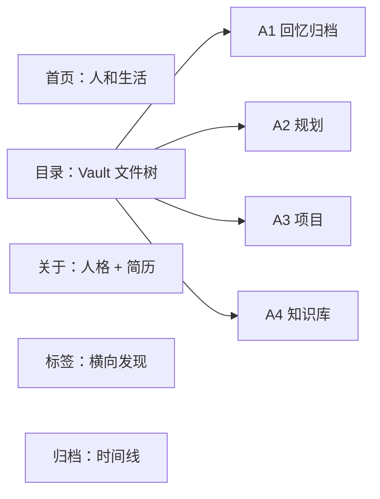

# 个人生活数字花园网站重构方案

> 版本：v0.3（执行版）  
> 日期：2026-08-09  
> 状态：**用户已批准执行、推送与部署**  
> 本方案只调整网站代码和网站专用数据，**不修改 `_vault/` 内容、目录和公开状态**。

## 1. 这次重构真正要解决什么

现在的网站把“何嘉华”表达成了一个工业软件作品集：首页是能力、技术栈和项目，关于页也是工作方向与项目经历。它也继承了 Chirpy 的通用博客外壳，内容虽然多，但人格、生活和情绪温度被压在了技术展示下面。

新的产品定义是：

> **这是何嘉华的个人生活与思想花园。**  
> 记录生活中闪烁的片段、逐渐形成的观点、喜欢的事和做过的尝试。软件开发是生活中占比较大且真心喜欢的一部分，但不是网站存在的唯一理由；电子简历和项目总结是自然沉淀出的副产品。

网站希望给作者和读者带来的感受：

- 打开网站时感到舒展、有生命力，而不是进入求职作品集；
- 看见一个会犹豫、会尝试、会慢慢成长的具体的人；
- 鼓励记录生活、尊重自己的节奏，并继续往更好的地方走；
- 内容可以尽可能开放，但公开必须始终由作者明确决定。

## 2. 现状判断

### 2.1 内容定位偏差

当前线上首页的核心文案是“把复杂系统做成真正可用的软件”，接下来依次展示工业桌面端、设备数据、AI 视觉和 AI 应用。这种结构适合求职作品集，但与“分享生活、思考和积极生活态度”的目标相反。

当前关于页也以工作方向、工作经历和代表项目为主体，“作为一个人是什么样的”几乎没有被表达。

### 2.2 导航和内容层级偏差

- Chirpy 的侧边栏、最近更新、热门标签等组件重复占据注意力；
- “项目”曾经被设计成独立一级入口，与 `_vault/A3-项目` 形成两套表达；
- Vault 目前能按文件夹生成页面，但不是一个可以像 Obsidian 一样持续展开、定位和阅读的文件浏览器；
- 标签和归档可用，但视觉仍然是主题默认的博客后台感。

### 2.3 可以找回的个人气质

2024 年网站配置中使用过：

> 慢一点，再慢一点，让时光凝结，让点滴闪烁。

公开日记中也已经出现了一条稳定的主线：

- “记录一下生活的闪光点，让生活变得不同起来”；
- “多给自我一些空间，多一些时间，在失败中走出成功的道路”；
- “记录每一滴闪烁的时光，寻找真正活着的感觉，组成对生命的热爱”；
- 接受事情会比计划更慢，寻找适合自己的节奏；
- 喜欢软件开发，也喜欢写作、小说、音乐、电影、运动、游戏、思考和陪伴他人。

这些内容比“工业软件工程师”更适合作为新网站的身份底色。

### 2.4 当前的人格设计假设

以下内容是根据已读日记形成的**工作假设**，不是心理诊断，也不是不可改变的标签。后续允许 AI 阅读更多本地日记后继续修正：

- 有很强的自我观察和意义追求，不满足于“日子只是重复”；
- 想把想到的事情真正做出来，重视自主、胜任、兑现和留下痕迹；
- 对失败、遗憾和时间流逝比较敏感，因此容易提高自我要求，也容易在完美与行动之间拉扯；
- 真正喜欢的不是单纯的技术，而是把模糊想法逐渐变清楚、变成真实作品的过程；
- 既需要秩序、计划和掌控感，也需要游戏、小说、音乐、电影、运动和人与人的连接；
- 更适合“诚实但不沉溺、温柔但不虚假”的表达，不适合职业宣传页，也不适合只展示阳光口号的励志模板。

因此首页不应把负面经历全部抹掉，而应把它们提炼成有边界的成长表达：承认迷失、犹豫和失控存在，但公开页面重点呈现从中形成的理解、选择与希望。网站的能量感来自真实的恢复过程，而不是假装永远积极。

## 3. 新的信息架构

全站主导航严格保留五项：

| 顺序 | 名称 | 地址 | 职责 |
|---:|---|---|---|
| 1 | 首页 | `/` | 讲述我是怎样的人、喜欢什么、相信什么，以及最近的生活 |
| 2 | 目录 | `/vault/` | 完整映射 `_vault`，用可展开文件树浏览所有公开内容 |
| 3 | 关于 | `/about/` | 人格介绍在前，电子简历、履历、技能和项目在后 |
| 4 | 标签 | `/tags/` | 按标签跨目录发现内容，保留现有能力 |
| 5 | 归档 | `/archives/` | 按年、月和日期展示新增内容 |

不再设置“项目”一级导航。项目仍然完整保留在：

```text
目录 → A3-项目 → 对应项目文件夹 → 项目简介与文档
```

旧地址处理：

- `/projects/`：保留兼容页或 301/HTML 跳转到 `/vault/A3-项目/`；
- `/categories/`：跳转到 `/vault/`；
- 已发布文章 permalink 保持不变；
- `/tags/`、`/archives/` 和 `/about/` 保持原地址。



## 4. 页面方案

### 4.1 全站框架

桌面端使用轻量顶部导航，不再使用 Chirpy 的深色固定侧栏：

```text
┌────────────────────────────────────────────────────────────┐
│  何嘉华 / 生活花园      首页  目录  关于  标签  归档   ◐   │
├────────────────────────────────────────────────────────────┤
│                                                            │
│                    当前页面内容                            │
│                                                            │
└────────────────────────────────────────────────────────────┘
```

- 导航始终只有五个文字入口；主题切换如保留，仅作为无文字工具按钮；
- 当前页面用细线、柔和底色或小圆点标识，不使用厚重侧栏高亮；
- 页面最大阅读宽度约 760px，目录页可以扩展到 1180px；
- 手机端五项导航进入一个简洁菜单，目录文件树成为抽屉；
- 页脚只保留一句个人签名、年份和 GitHub 链接，不重复热门标签。

### 4.2 首页：先让人被看见

首页不再出现“能力矩阵”“工作闭环”“精选项目”等求职语言。建议结构：

1. **第一屏：自我介绍**
   - 推荐主标题：`你好，我是何嘉华。`
   - 推荐副标题：`慢一点，再慢一点，让时光凝结，让点滴闪烁。`
   - 2—3 句话说明：喜欢记录生活和思考，也喜欢把想法做成软件；仍在寻找自己的节奏，但愿意持续走下去。
   - 一张有呼吸感的主视觉，可以是本人拥有版权的生活照片、插画或照片拼贴。

2. **我喜欢的事**
   - 软件开发；
   - 写作与记录；
   - 小说、音乐与电影；
   - 运动与散步；
   - 游戏和有趣的体验；
   - 把模糊想法慢慢做成真实事物。

   这里使用自然语言短句，不使用技术栈徽章。

3. **我相信的事**
   - 记录能让生活不只是重复；
   - 允许自己慢一点，成长不等于永远高效；
   - 想到以后先迈出一步，再用思考和能力把它变清晰；
   - 失败不是身份，可以从失败里走出道路。

4. **最近的生活与思考**
   - 自动取最近 6 篇 `published: true` 内容；
   - 只展示日期、标题、所属 Vault 路径和很短的摘要；
   - 不按“项目/技术”优先，完全按真实更新时间展示。

5. **生活切片**
   - 3—5 张经过人工选择的照片或插画；
   - 不自动扫描日记图片；
   - 图片清单写在网站专用 `_data/home.yml` 中，防止私人照片意外出现。

### 4.3 目录：Obsidian 式公开文件浏览器

目录页采用两栏结构：

```text
┌──────────────────────┬─────────────────────────────────────┐
│  PUBLIC VAULT        │  A1-回忆归档 / B1-24年回忆          │
│                      │                                     │
│  ▾ A1-回忆归档       │  当前文件夹说明 / 文章正文           │
│    ▾ B1-24年回忆     │                                     │
│      ○ 记录感受生活  │                                     │
│      ○ 平衡          │                                     │
│  ▸ A2-规划           │                                     │
│  ▸ A3-项目           │                                     │
│  ▸ A4-知识库         │                                     │
└──────────────────────┴─────────────────────────────────────┘
```

文件树规则：

- 树结构直接来自公开的 `_vault/A*/B*/C*` 真实路径；
- 只包含 `published: true` 文件；一个文件夹没有任何公开后代时不展示；
- 文件夹排在文件前面，并按 A/B/C 数字自然排序；
- 点击三角图标只展开/收起；点击文件夹名称打开文件夹介绍；点击文件打开文章；
- 当前文章所在的祖先路径自动展开，当前文件高亮；
- 展开状态保存在本机，下次访问继续保持；
- 文件夹页面右侧显示直属子文件夹和直属文件，不把所有后代一次铺平；
- 文章页保留同一文件树，读者无需返回目录根节点；
- 键盘可以操作展开按钮，使用正确的 `aria-expanded`；
- 手机端文件树默认收起，通过“打开目录”按钮显示为全屏抽屉。

明确不做：知识图谱、双链图、悬浮预览、在线编辑、全文搜索和自动推荐。这一阶段只把目录浏览做稳定。

### 4.4 关于：先介绍人，再展示履历

关于页分为两个层次。

第一部分“关于我”：

- 一段第一人称自述；
- 喜欢的事、性格倾向、正在学习如何生活；
- 个人价值观与网站为什么存在；
- 可选的本人照片、日常照片或拥有使用权的插画。

第二部分“经历与能力”：

- 教育经历；
- 工作/实践时间线；
- 技能按“我能做什么”描述，不做几十个标签堆砌；
- 代表项目只保留 3—5 个，每个项目链接回 `A3-项目` 的真实目录；
- GitHub 和邮箱；默认不公开手机号、公司内部信息和精确住址。

关于页资料生成规则：

- AI 可以读取本地 `_vault` 中 `published: true` 和 `published: false` 的日记、规划与项目文档，用于理解人格、经历和长期变化；
- AI 可以推测性格，但应区分“多篇材料反复出现的稳定倾向”和“某一时期的临时状态”，并给出置信度；
- 允许从负面和黑暗内容中提炼性格与成长线索，但不能在公开文案中复述敏感细节，除非用户明确批准；
- API Key、密码、Token、私钥等凭据不属于人格素材；进入模型上下文前应先跳过或遮盖，不主动把有效凭据发送给模型；
- 草稿写入网站专用 `_data/profile.yml`，不写回 `_vault`；
- 证据、来源路径、推测过程和置信度写入被 Git 忽略的 `.profile-work/`，不能因为引用了私密文件而把私密路径或原句带到公开页面；
- `_data/profile.yml` 只保存最终允许公开的自我介绍和履历事实；
- 不在构建或部署时调用模型，生成是一次可审查、可重跑的本地准备步骤；
- 可以推测人格，不能发明经历、成果、关系、诊断或把项目文档包装成工作事实；
- 第一版可以由 AI 自动起草，但在进入网站前仍需用户进行一次整体阅读确认。

### 4.5 标签

- 功能与现在一致：标签名称、文章数量、标签文章列表；
- 标签首页使用疏密有序的标签清单，不做彩色技能云；
- 标签文章仍显示所属 Vault 路径，避免失去目录上下文；
- 合并大小写或同义标签属于以后单独的内容整理任务，本次不改 `_vault`。

### 4.6 归档

- 保留当前按年份倒序的主体逻辑；
- 优化为“年 → 月 → 条目”的时间线；
- 每年显示文章数量，每个月可以折叠；
- 条目显示日期、标题和一级 Vault 领域；
- 不添加统计图表和活跃度热力图。

### 4.7 文章阅读页

- 桌面端：左侧目录树 + 中间正文；不再叠加 Chirpy 的右侧热门内容；
- 顶部显示 Vault 面包屑、标题、日期、标签；
- 正文使用较大的行距、克制的标题层级和舒适的中文宽度；
- 图片允许宽于正文，但需要标题或替代文本；
- 长文目录可作为正文上方的折叠区域，不新增第三根固定侧栏；
- 文章底部只保留上一篇/下一篇（按时间）和返回当前文件夹。

## 5. 视觉方向

建议主题名：**晨光手账 / Morning Garden**。

关键词：

> 温柔、明亮、松弛、清醒、生命力、手账感、留白、轻微的幻想感。

建议色板：

| 用途 | 色值 | 感受 |
|---|---|---|
| 主背景 | `#FBF8F1` | 温暖纸张，而不是纯白后台 |
| 正文 | `#30343B` | 柔和墨色 |
| 天空蓝 | `#A8C8E8` | 清醒、开放 |
| 苔藓绿 | `#87A88B` | 成长、自然 |
| 晨曦粉 | `#DDA6B8` | 延续旧主页的柔和粉色记忆 |
| 杏橙强调 | `#E99A72` | 能量和行动感 |
| 分隔线 | `#E8E0D5` | 轻，不制造后台表格感 |

设计原则：

- 中文标题可使用宋体/衬线系统字体，正文使用清晰的无衬线系统字体；
- 不使用科技蓝霓虹、代码终端、玻璃拟态 KPI 卡片和大段英文职业口号；
- 动效只用于页面淡入、文件夹展开和链接反馈，并尊重 `prefers-reduced-motion`；
- 卡片减少，更多使用自然分区、图片、文字和细线；
- 可以保留明暗模式，但亮色是主表达，暗色不是简单反相；
- 2024 年的粉色插画只作为情绪板。除非用户确认版权和继续使用，否则不直接作为新首页大图；
- 当前柴犬头像可以保留为生活化小元素，但不默认当作个人身份主视觉。

## 6. 技术方案

### 6.1 推荐：保留 Jekyll 内容引擎，完全移除 Chirpy UI

“完全重写”应作用于 UI 与主题，而不是推倒已经验证过的安全发布链路。

保留：

- Jekyll 静态生成；
- GitHub Actions 与 GitHub Pages；
- `_vault` 目录与 `published: true` 门控；
- Vault 图片复制、稳定文章 URL 和发布校验脚本；
- `_posts` 的旧内容兼容策略。

移除或重写：

- `jekyll-theme-chirpy` 依赖和 `_config.yml` 中所有 Chirpy 专属配置；
- 当前所有 UI layout；
- Chirpy 的侧栏、顶栏、最近更新、热门标签、搜索弹层和主题组件；
- 当前 `assets/css/style.scss`；
- 当前首页的职业作品集文案和项目橱窗逻辑。

从零建立：

```text
_layouts/
├─ base.html
├─ home.html
├─ directory.html
├─ folder.html
├─ post.html
├─ about.html
├─ tags.html
├─ tag.html
├─ archives.html
└─ error.html

_includes/
├─ head.html
├─ site-header.html
├─ site-footer.html
├─ vault-tree.html
├─ post-meta.html
└─ theme-toggle.html

_data/
├─ home.yml              # 首页固定文案与人工批准的图片
└─ profile.yml           # 关于/简历审核后的事实数据

assets/
├─ css/main.scss         # 自建 tokens、基础排版、组件和页面样式
└─ js/
   ├─ vault-tree.js      # 展开、收起、定位与状态保存
   └─ theme.js           # 可选的明暗模式
```

`_plugins/vault_generator.rb` 继续负责安全读取，但输出调整为：

- 公开文章列表；
- 嵌套 Vault 树数据；
- 文件夹页面；
- 标签与归档需要的标准字段；
- 当前文章的完整路径。

浏览器端 JavaScript 不读取仓库、不判断公开状态，只渲染构建阶段已经筛选好的树。

### 6.2 为什么不直接迁移到 Quartz 或 Astro

Quartz 的文件树非常适合借鉴，但直接迁移会替换当前 Jekyll 生成器、URL、图片复制和 fail-closed 发布门控；AstroPaper 的导航与归档清楚，但也会让 `_vault` 重新适配另一套内容集合。两者都会扩大这次任务并增加私人内容误发布风险。

因此本期只借鉴交互和代码组织，不更换静态站点引擎。等自建 UI 稳定后，如果 Jekyll 真正成为限制，再单独评估迁移。

这不是因为 Jekyll 更流行，而是因为它已经验证了 `_vault` 的图片、URL 和 `published` 门控。热门框架能减少部分 UI 工作，却会重新打开最危险的发布边界。当前更合适的组合是：**Jekyll 负责可靠构建，借鉴 Quartz 的目录交互，沿用已配置好的 GitHub Pages 发布入口，自建全部视觉组件。**

### 6.3 本地完整 Vault 与公开仓库必须分层

继续使用公开仓库 `hejiahua007/hejiahua007.github.io`。`published` 同时决定 Vault 文件能否进入 Git 和能否进入网站：只有精确布尔值 `true` 才能离开本地电脑。

推荐数据流：

```text
本地完整 Vault
  ├─ 凭据/密钥文件：只留本地或密码管理器，禁止 Git、禁止构建
  ├─ published: false：只留本地，不进入 Git、不进入 _site
  └─ published: true：经 safe-publish 暂存，允许进入公开仓库

公开 GitHub 源仓库
  └─ 只包含网站代码、published: true 文章与其引用资源

公开 GitHub Pages
  └─ 只包含 published: true 的生成结果
```

实施时新增两类确定性检查：

1. **源码暂存检查**：`safe-publish.ps1` 清理 `_vault` 暂存范围，只强制添加 `published: true` 及其引用资源；对 `false` 和非法文件取消跟踪并保留本地副本。
2. **公开产物审计**：构建后检查 `_site`，确保没有 `published: false` 的文件、标题、原始路径或资源被复制到 artifact。

任何代码、方案和普通资源使用显式路径暂存；Vault 只能由 `safe-publish.ps1` 处理。禁止 `git add .` 或 `git add -A`。

## 7. 参考仓库与具体借鉴点

### [Quartz](https://github.com/jackyzha0/quartz)

借鉴：

- Explorer 使用真实文件树；
- 文件夹优先、数字自然排序；
- 当前路径自动展开；
- 展开状态保存到浏览器；
- 文件夹图标和标题拥有不同点击行为；
- 移动端目录单独收起。

不照搬：Quartz 框架、知识图谱、双链系统和完整组件代码。我们会用原生 JavaScript 按本站数据结构重新实现。

### [AstroPaper](https://github.com/satnaing/astro-paper)

借鉴：

- 顶部导航清楚、当前页面状态明确；
- 跳到正文、键盘操作和移动端可访问性；
- 归档按年/月分组，而不是一张无限列表；
- 页面组件职责分离。

不照搬：Astro、Tailwind、Pagefind 和它的视觉主题。

### [Maggie Appleton 的数字花园 V3](https://github.com/MaggieAppleton/maggieappleton.com-V3)

借鉴：

- 网站首先是一个持续生长的人格化花园；
- 允许半成形的观点和长期更新的内容共存；
- 首页呈现作者兴趣和气质，而不是产品功能；
- 视觉需要从作者自身出发。

不照搬：其 README 也明确鼓励每个人建立自己的花园，而不是复制他人的身份设计。因此只学习内容观念，不复制页面。

### [Obsidian Digital Garden](https://github.com/oleeskild/obsidian-digital-garden)

借鉴：

- 文件树导航；
- 私人内容默认不公开；
- 只展示明确标记为公开的笔记；
- 网站是 Vault 的选择性公开视图。

不引入它的 Obsidian 插件、Vercel 流程、图谱和完整模板。

### 本仓库 2024 年版本

借鉴：

- “慢一点，再慢一点，让时光凝结，让点滴闪烁”的个人签名；
- 柔和粉色、插画和生活化表达；
- 建站初心是记录学过的东西与生活闪光点，而不是制作求职页面。

## 8. 内容与隐私边界

必须把以下三件事分开，不能只靠一个 `published` 字段处理：

| 边界 | 允许进入公开 GitHub 仓库 | 允许提供给本地 AI | 允许进入公开网站 |
|---|---:|---:|---:|
| `published: true` 的普通内容 | 是 | 是 | 是 |
| `published: false` 的普通内容 | 否，只留本地 | 是 | 否 |
| 负面、低落、矛盾等私人表达 | 否，只留本地 | 是，用于理解而非公开复述 | 否，除非作者另行改为 `true` |
| API Key、密码、Token、私钥、证书、`.env` | **否** | **否，应先遮盖或移除** | **否** |

本次重构继续执行以下规则：

- 只有精确 YAML 布尔值 `published: true` 才进入网站；
- `false`、缺失、字符串、重复或格式错误字段全部不发布；
- 首页、目录、标签、归档、相关推荐、站点地图、RSS 和搜索数据必须共用同一公开门控；
- 首页图片必须进入 `_data/home.yml` 人工白名单；
- AI 可以读取本地的 `published: false` 内容，但生成公开文案时只能输出抽象后的稳定特征，不复制私人事件、他人信息或负面细节；
- AI 可以推测性格，但必须把“原文事实”“稳定倾向”“低置信度推测”分开，不进行心理诊断，不虚构履历；
- 性格分析的证据路径、置信度和草稿放在 Git 忽略的 `.profile-work/`，人工批准后的公开事实才写入 `_data/profile.yml`；
- `published` 不负责检测凭据。源文件在进入 Git 前必须单独进行 Secret 扫描；
- 本次方案和后续 UI 实现不批量改写 `_vault` 内容与目录；
- 正式发布前继续执行人工审查，不自动提交或推送。

网站也不能自动准确判断“负面”是否应该隐藏。AI 可以用这些内容理解作者，但是否公开仍然只由作者显式设置 `published: true` 决定。

## 9. 公开仓库与 GitHub Pages 部署方案

### 9.1 唯一目标仓库

- 源仓库：`git@github.com:hejiahua007/hejiahua007.github.io.git`；
- 线上地址：`https://hejiahua007.github.io/`；
- 仓库保持公开，不购买额外套餐；
- 不切换 Remote，不再考虑其他同名或近似名称仓库。

### 9.2 推送前的确定性门控

每次发布按固定顺序执行：

```powershell
.\tools\validate-vault.ps1 -ChangedOnly
.\tools\safe-publish.ps1 -DryRun
.\tools\safe-publish.ps1
git diff --cached --stat
git diff --cached
```

然后显式暂存网站代码和方案文件；不得使用 `git add .` 或 `git add -A`。提交前必须核对：

- Git 索引内没有 `published: false`、缺失或非法状态的 Vault 文件；
- 公开文章所引用的本地图片都已进入暂存；
- `_site` 不被提交；
- API Key、密码、Token、私钥、`.env` 和证书均未进入 Diff；
- 本地 `false` 文件仍然存在，没有被删除。

### 9.3 GitHub Pages 设置

继续沿用当前已工作的发布模式：`main` 触发 GitHub Actions，构建、检查后发布到 `gh-pages`。

GitHub 网页应保持：

1. **Settings → Pages → Build and deployment**：选择 `Deploy from a branch`；
2. Branch 选择 `gh-pages`，目录选择 `/(root)`；
3. **Settings → Actions → General → Workflow permissions**：允许工作流写入仓库内容，以便更新 `gh-pages`；
4. 不需要建立自定义 Token 或 Actions Secret；
5. 这是用户名根站点，不需要 `CNAME`；Jekyll `url` 为 `https://hejiahua007.github.io`，`baseurl` 保持空字符串。

部署脚本只处理构建后的静态产物，不接触本地完整 Vault。主仓提交仍然必须经过 `safe-publish.ps1`。

### 9.4 部署与核验

1. Push `main` 后，在仓库 **Actions** 查看构建工作流；
2. 工作流执行 Jekyll 生产构建和 HTML-Proofer；
3. 成功后更新 `gh-pages`；
4. 打开线上首页、目录、关于、标签和归档；
5. 随机验证至少 5 篇公开文章与图片；
6. 用本地 `false` 文章的标题、文件名和路径检查 `_site` 与线上站点，结果必须为空；
7. 确认旧公开文章 URL 仍可访问。

## 10. 实施阶段（批准方案后才开始）

### 阶段 0：建立可回退的重构分支

- 确认继续使用公开仓库 `hejiahua007/hejiahua007.github.io` 和根地址；
- 确认本地 `published: false` 文件均未被 Git 跟踪；
- 从当前 `main` 建立 `codex/life-garden-redesign`；
- 记录当前线上 URL、文章 URL 和校验结果；
- 不在 `main` 上直接拆除主题。

完成线：重构期间线上网站不受影响，任何时候可以放弃分支。

### 阶段 1：脱离 Chirpy，建立自有页面骨架

- 调整 Gemfile 与 `_config.yml`；
- 新建 base/head/header/footer；
- 建立五项导航和基础视觉 tokens；
- 先完成首页、关于、标签、归档的空壳和 404；
- 保留旧 URL 兼容。

完成线：不依靠 Chirpy 也能构建所有基础页面，导航只有五项。

### 阶段 2：实现 Vault 文件树

- 让生成器输出唯一的公开嵌套树；
- 实现文件夹/文件节点、自然排序和当前路径；
- 实现桌面两栏、移动抽屉、展开状态保存和键盘操作；
- 文件夹页和文章页共用同一棵树。

完成线：从根目录可以逐层打开任意公开文章，刷新后目录状态合理保留。

### 阶段 3：重写首页和文章阅读体验

- 根据批准的首页文案建立人格化首页；
- 接入最近公开内容；
- 加入人工批准的图片；
- 重写文章排版、面包屑、图片、代码、表格和长文目录。

完成线：首页不再像简历；生活、观点与近期记录成为主体。

### 阶段 4：生成并审核关于页

- 根据用户排除清单读取本地 Vault；允许参考 `published: false` 日记和项目，但在送入模型前剔除凭据；
- 在 `.profile-work/` 生成“事实 / 稳定倾向 / 推测 / 置信度 / 来源路径”审计草稿；
- 起草 `_data/profile.yml`；
- 对照来源逐条审查，删除私人事件、负面细节、他人信息和无根据推测；
- 项目作为简历的下半部分，并链接到 A3 真实目录。

完成线：关于页既能回答“我是怎样的人”，也能作为可信的电子简历。

### 阶段 5：加固公开仓库发布链路

- 保留 `main → GitHub Actions → gh-pages` 的现有部署入口；
- 用 `safe-publish.ps1` 保证 Git 索引只包含明确公开的 Vault 文件；
- 接入公开产物审计，移除部署脚本中的宽泛暂存命令；
- 先在重构分支完成预览和检查，不提前覆盖线上站点。

完成线：本地私密内容不会进入 Git 或 `_site`，部署只有一个明确入口。

### 阶段 6：验收后再发布

- 桌面、平板、手机尺寸检查；
- 键盘导航、目录展开、明暗模式检查；
- 检查五个主入口、旧 URL、全部文章链接和图片；
- 执行 Vault 校验、发布预演、Jekyll 构建和 HTML 链接检查；
- 给用户查看本地截图/预览；
- 用户明确批准后，才进入提交和推送流程。

## 11. 验收标准

### 产品

- 导航只有：首页、目录、关于、标签、归档；
- 首页第一屏没有职业头衔、技术栈和项目 CTA；
- 首页能清楚表达作者喜欢什么、相信什么、为什么记录；
- 项目只作为生活内容和简历的一部分，不再控制全站叙事；
- 关于页先介绍人，再展示履历。

### 目录

- 公开文件树与 `_vault` 层级一致；
- 不出现任何非 `published: true` 文件；
- 文件夹可以展开/收起；
- 当前路径自动展开并高亮；
- 点击文件可以打开文章；
- 文件夹页面、文章页面都能继续使用同一棵树；
- 手机端目录可用，键盘操作可用。

### 视觉

- 不再出现 Chirpy 的侧栏和默认组件；
- 首页、目录、关于、标签、归档和文章页属于同一视觉系统；
- 明亮、柔和、有留白，不像后台、简历模板或技术文档站；
- 390px、768px、1440px 三档宽度无溢出；
- 动效关闭时仍可完整使用。

### 安全与质量

- `_vault` 在 UI 重构中没有被批量修改；
- `validate-vault.ps1 -ChangedOnly` 为 0 error；
- `git ls-files _vault` 中没有任何 `published: false`、缺失或非法文件；
- Secret 扫描无 API Key、密码、Token、私钥、`.env` 或证书泄漏；
- `safe-publish.ps1 -DryRun` 继续通过旧公开链路兼容检查；
- Jekyll 构建成功；
- `_site` 与 Pages artifact 中没有任何 `published: false` 的标题、正文、文件路径和附属资源；
- HTML-Proofer 内部链接为 0 failure；
- 旧公开文章 URL 不变；
- `gh-pages` 只包含构建后的静态网站，不包含 `_vault` 源目录；
- 用户预览并明确批准后才允许提交或推送。

## 12. 请用户直接在这里填写/修改

这些问题会实质影响视觉或公开内容。请直接在本文件中填写，不需要在聊天框逐题回复。

### 12.1 网站身份

- 网站显示名称：`何嘉华的生活花园`（可改：__________）
- 首页主标题：`你好，我是何嘉华。`（可改：__________）
- 首页签名：`慢一点，再慢一点，让时光凝结，让点滴闪烁。`（保留 / 修改为：__________）
- 希望读者离开网站时记住的一句话：__________

### 12.2 视觉与图片

- “晨光手账”方向：接受 / 修改为：__________
- 主色更偏：晨曦粉 / 天空蓝 / 苔藓绿 / 其他：__________
- 是否保留暗色模式：是 / 否
- 2024 年粉色人物插画：只作参考 / 继续使用 / 不再使用
- 当前柴犬头像：保留 / 更换 / 只在小角落使用
- 首页主视觉希望使用：本人照片 / 自己拍的风景 / 已有插画 / 后续生成原创插画 / 其他：__________
- 允许使用的图片路径或日记范围：__________

### 12.3 首页内容

- “我喜欢的事”需要增加或删除：__________
- “我相信的事”需要增加或删除：__________
- 最近内容数量：6 篇 / 其他：__________
- 是否展示生活照片带：是 / 否
- 是否有不希望首页强调的内容：__________

### 12.4 关于与简历

- AI 可读取范围：默认本地完整 Vault（包括 `published: false`，凭据先遮盖）；需要排除的目录：__________
- 允许 AI 根据多篇记录推测稳定性格：已确认允许；需要排除的推测方向：__________
- 负面内容的使用边界：默认“仅帮助理解，不公开复述具体事件和措辞”；修改为：__________
- 关于页优先参考的日记或项目路径：__________
- 工作经历公开到什么程度：__________
- 联系方式：仅 GitHub + 邮箱 / 其他：__________
- 是否展示真实头像：是 / 否 / 暂不决定
- 项目展示数量：3 / 5 / 其他：__________

### 12.5 目录交互

- 点击文件夹名称：打开文件夹页面 / 只展开文件夹
- 默认状态：只展开当前路径 / 全部折叠 / 记住上次状态
- 文件树中显示 A/B/C 前缀：显示 / 隐藏但按前缀排序
- 手机目录形式：全屏抽屉 / 页面顶部折叠区

### 12.6 仓库与部署确认

- [x] 继续使用公开仓库 `hejiahua007/hejiahua007.github.io`。
- [x] 最终网站地址保持 `https://hejiahua007.github.io/`。
- [x] 不购买额外 GitHub 套餐，不使用其他新仓库。
- [x] `published: false`、缺失或非法状态的 Vault 文件只留在本地电脑。
- [x] API Key、密码、Token、私钥和 `.env` 永不进入 Git。

### 12.7 最终批准

- [x] 我已确认网站定位、视觉方向和隐私边界。
- [x] 我确认本期保留 Jekyll，但完全移除 Chirpy UI。
- [x] 我确认本期不修改 `_vault` 内容、目录和公开状态。
- [x] 我批准 AI 在本地读取 `published: false` 内容并推测性格，但不公开复述私人细节。
- [x] 我确认公开仓库只接收 `published: true` 内容。
- [x] 我确认凭据类敏感信息不会被提交到任何 Git 仓库。
- [x] 我批准实施、提交、推送与部署。

用户已在 2026-08-09 明确批准，按本方案继续完成构建、校验、提交、推送与部署。
